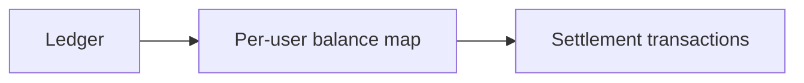

# settlement

The settlement module turns a ledger into a minimal set of suggested transfers between users.

## Model

## Algorithm

### Step 1 — Balance accumulation

For each effective bill, `split_shares` is called once for the payer side and once for the payee side. The resulting per-user cent amounts are accumulated into a `HashMap<Ulid, i64>`:

- payer amounts are added (positive — owed money)
- payee amounts are subtracted (negative — owes money)

The balance map implicitly represents each user's net relationship with a virtual system node: positive means the system owes the user, negative means the user owes the system.

### Step 2 — Greedy reduction

Creditors (positive balances) and debtors (negative balances) are each sorted by `(amount desc, user_id asc)`. The largest creditor and largest debtor are matched iteratively:

- the transaction amount is `min(creditor_balance, debtor_balance)`
- both balances are reduced by that amount
- exhausted entries are removed
- repeat until all balances are zero

Sorting by user ID as a tiebreaker ensures the output is identical for the same input regardless of `HashMap` iteration order.

This minimizes the number of transfers.

## Share splitting

For a given share list and total amount:

1. Compute each user's ideal amount as `floor((total_cents × share_weight) / total_weight)`.
1. Sum the floored amounts; `remainder = total_cents − sum`.
1. Select the remainder recipient by index `hash(bill_id) mod len(shares)`, where `hash` is a fixed deterministic hash function (FNV-1a over the bill ID bytes).

This guarantees the split sums exactly to `total_cents`. Because the recipient index is derived solely from the bill ID, every peer independently arrives at the same result for the same bill.

## Rules

- all arithmetic is integer cents
- balances are accumulated from effective bills only
- the total of all balances sums to zero
- the reduction step minimizes the number of transfers, not narrative fairness or payment ordering
- multi-ledger aggregation and per-user filtering are the responsibility of the service layer
