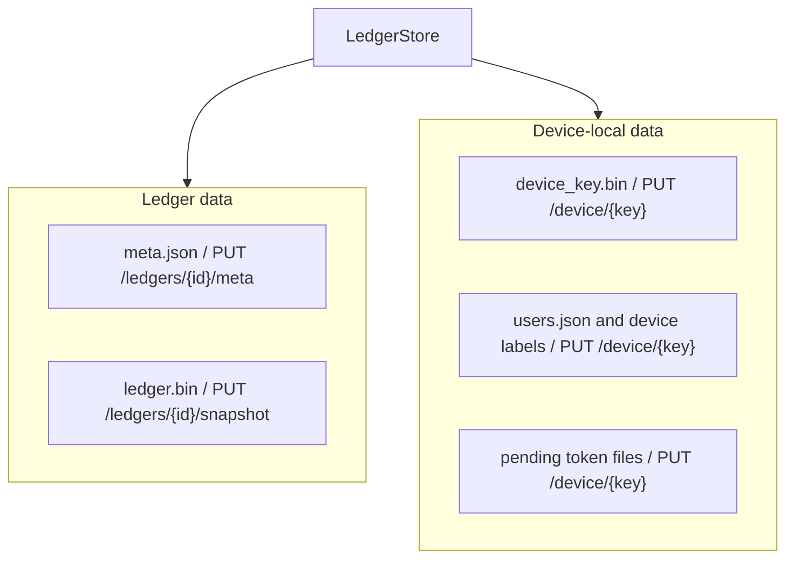

# storage

The storage module is the persistence boundary for unbill. It stores full ledger snapshots, lightweight ledger metadata, and device-local metadata without exposing backend details to higher layers.

## Contract

- `LedgerStore` loads and saves whole-ledger snapshots
- ledger metadata supports fast listing without hydrating Automerge bytes
- device-local metadata stores saved users, labels, and pending token state
- callers do not depend on path layout, file names, or server URLs directly

## Persistence View



## Implementations

### FsStore

Flat-file store backed by `tokio::fs`. Writes ledger data under
`<root>/ledgers/<id>/` and device metadata as top-level files under `<root>/`.
Writes are atomic via `.tmp` sibling + rename.

### InMemoryStore

In-process store backed by `Mutex<HashMap>`. For unit tests only.

### HttpStore

REST store backed by an HTTPS server. All data lives on the remote server; the
client holds only the base URL and an API key. This is the right choice when a
single authenticated device wants a cloud-backed ledger without running local
storage.

#### REST API contract

Authentication: every request carries `Authorization: Bearer <api_key>`.

| Method | Path | Request body | Success | Notes |
|----------|----------------------------|---------------------------|---------|------------------------------------|
| `GET` | `/ledgers` | — | 200 JSON array of `LedgerMeta` | Empty array when none exist |
| `PUT` | `/ledgers/{id}/meta` | JSON `LedgerMeta` | 204 | |
| `GET` | `/ledgers/{id}/snapshot` | — | 200 `application/octet-stream` | 404 when not yet saved |
| `PUT` | `/ledgers/{id}/snapshot` | `application/octet-stream`| 204 | Overwrites any previous snapshot |
| `DELETE` | `/ledgers/{id}` | — | 204 | Idempotent; 404 also treated as success |
| `GET` | `/device/{key}` | — | 200 `application/octet-stream` | 404 → `None` |
| `PUT` | `/device/{key}` | `application/octet-stream`| 204 | |

The `LedgerMeta` JSON shape is the same flat object used by `FsStore`:

```json
{
  "ledger_id": "<ulid>",
  "name": "<string>",
  "currency": "<ISO 4217 code>",
  "created_at_ms": 1234567890,
  "updated_at_ms": 1234567890
}
```

#### Error mapping

- `401` → `StorageError::Unauthorized`
- `404` on load → empty / `None` (not an error)
- any other non-2xx → `StorageError::Http(status, body)`

## Rules

- shared ledger bytes and local metadata are stored separately
- the store is the only layer that knows how data is laid out on disk or on the server
- storage is whole-snapshot oriented rather than incremental append logging
