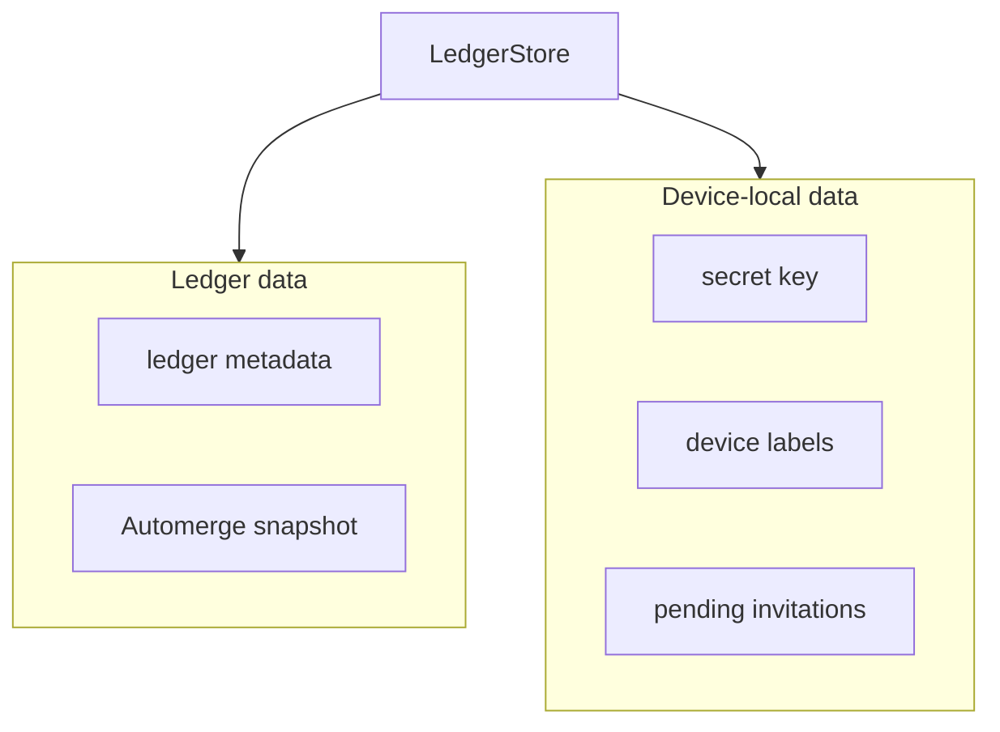

# unbill-storage

The persistence boundary for unbill. It stores full ledger snapshots, lightweight ledger metadata, and device-local metadata without exposing storage details to higher layers.

## Contract

- `LedgerStore` loads and saves whole-ledger snapshots as Automerge documents
- ledger metadata supports fast listing without hydrating Automerge bytes
- device-local metadata stores device labels, saved users, and pending token state under well-known string keys
- `save_ledger` may merge remote changes back into the caller's `doc` before returning; the caller must treat `doc` as the authoritative merged state after the call
- `get_secret_key` returns `Err(StorageError::Unauthorized)` on stores that cannot expose raw key material

## Data boundary

## Rules

- shared ledger bytes and local metadata are stored separately
- storage is whole-snapshot oriented rather than incremental append logging
- callers do not depend on key names or layout directly; they use the typed helpers in this crate
